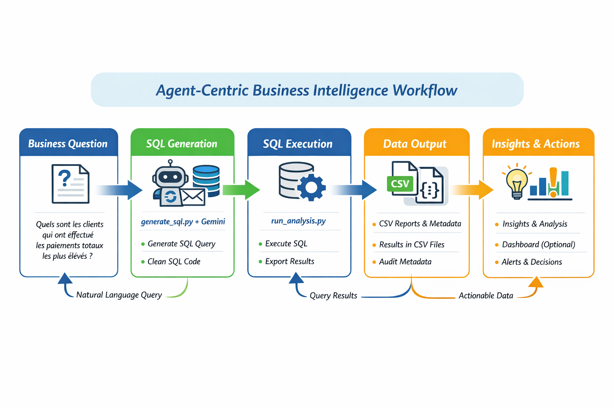

# Agentic Business Intelligence

**Une nouvelle façon de faire de la Business Intelligence, pilotée par des Agents IA**



## 🚀 Présentation générale

**Agentic Business Intelligence** est un projet open-source qui propose une approche **radicalement nouvelle** de la Business Intelligence (BI) en entreprise.

L’objectif est simple mais ambitieux :

> 👉 **Permettre à n’importe quel utilisateur (consultant, analyste métier, data analyst, équipe produit) d’extraire de la valeur de données SQL brutes, sans dépendre d’outils BI lourds, coûteux ou complexes comme Power BI ou Tableau.**

Pour cela, la solution repose sur un principe clé :
**la BI pilotée par des Agents IA (Agent-centric BI)**.

---

## 🧠 Le problème que ce projet adresse

Dans la majorité des entreprises aujourd’hui, la BI repose sur un modèle devenu lourd et rigide :

* Des **bases de données SQL** (PostgreSQL, MySQL, SQL Server, etc.)
* Des **outils BI** (Power BI, Tableau, Looker, etc.)
* Des **intermédiaires humains** (analystes, consultants, ESN) pour :

  * écrire les requêtes SQL
  * construire des modèles de données (star schema, snowflake schema, etc.)
  * maintenir les dashboards
  * expliquer les chiffres aux métiers

Ce modèle pose plusieurs problèmes :

### ❌ Problèmes organisationnels

* Dépendance forte aux profils techniques
* Allers-retours incessants entre métiers et data teams
* Temps long entre la question métier et la réponse

### ❌ Problèmes techniques

* Dashboards figés, peu flexibles
* Coût élevé des licences BI
* Complexité de maintenance
* Difficulté d’audit (que fait vraiment un graphique ?)

### ❌ Problèmes stratégiques

* La donnée est là… mais la décision arrive trop tard
* Les petites structures (PME, startups, consultants indépendants) sont souvent exclues de la BI “classique”

---

## 💡 L’idée fondatrice du projet

**Et si on supprimait complètement l’interface BI classique ?**

Et si :

* l’utilisateur posait **directement ses questions métier en langage naturel**,
* un **Agent IA** :

  * comprenait le schéma de la base de données,
  * générait la requête SQL adéquate,
  * exécutait la requête,
  * produisait les résultats,
  * générait un graphique interactif pertinent,
  * et fournissait des **insights et recommandations actionnables** ?

👉 C’est exactement ce que fait **Agentic Business Intelligence**.

---

## 🧩 Le concept : Agent-centric BI

Le projet met en œuvre un pipeline BI **entièrement piloté par des Agents IA**, structuré autour du flux suivant :

```
Question métier (langage naturel)
        ↓
Compréhension du schéma SQL
        ↓
Génération de requête SQL auditable
        ↓
Exécution sur la base de données
        ↓
Extraction des données (CSV)
        ↓
Visualisation interactive (HTML / Plotly)
        ↓
Insights & Actions (Markdown)
```

Chaque étape :

* est **transparente**
* est **auditable**
* produit des **artefacts concrets** (SQL, CSV, HTML, Markdown)

👉 Rien n’est caché derrière une interface opaque.

---

## 🔍 Ce que fait concrètement la solution

Avec **Agentic Business Intelligence**, vous pouvez :

* Travailler **directement sur vos bases PostgreSQL**
* Sélectionner dynamiquement :

  * la base de données
  * le schéma SQL
* Poser des questions comme :

  * *“Quels sont les clients les plus rentables ?”*
  * *“Quelle est l’évolution du chiffre d’affaires par mois ?”*
  * *“Comment se répartissent les effectifs par âge et par genre ?”*
* Obtenir automatiquement :

  * une requête SQL propre et commentée
  * un fichier CSV de résultats
  * un graphique interactif (HTML)
  * un document d’**insights & recommandations**

Le tout :

* **sans écrire de code**
* **sans créer de dashboard**
* **sans licence BI**

---

## 🛠️ À qui s’adresse ce projet ?

### 🎯 Consultants Data / BI

* Gagner du temps sur l’analyse
* Réduire la dépendance aux outils BI lourds
* Prototyper rapidement des analyses chez un client

### 🎯 Analystes métier

* Devenir autonomes face aux données
* Comprendre les chiffres sans attendre un dashboard

### 🎯 PME / Startups

* Mettre en place une BI moderne à coût réduit
* Exploiter leurs données SQL existantes

### 🎯 Recruteurs & managers techniques

* Découvrir une approche innovante de la BI
* Évaluer un projet complet mêlant Data, IA et Engineering

---

## 🌱 Philosophie du projet

Ce projet est :

* **Open-source** (licence MIT)
* **Transparent** (SQL généré, données visibles)
* **Orienté valeur métier**, pas “jolis dashboards”
* **Pragmatique** : fonctionne en local, en CLI, en TUI ou via Docker
* **Évolutif** : conçu pour s’étendre à d’autres SGBDR et à un futur SaaS

---

## 📌 En résumé

**Agentic Business Intelligence** n’est pas :

* un énième outil BI
* un simple script IA
* un gadget expérimental

👉 C’est un **moteur de Business Intelligence piloté par des Agents IA**, pensé pour :

* accélérer la prise de décision,
* démocratiser l’accès à la donnée,
* et réduire la dépendance aux outils BI traditionnels.


---

# Installation et utilisation de la solution en local (codebase)

Cette section explique **pas à pas** comment installer **Agentic Business Intelligence** sur votre machine et exécuter un workflow complet, depuis une question métier jusqu’aux insights et recommandations.

La solution fonctionne sur **Windows, Linux et macOS**.

---

## ✅ Prérequis

Avant de commencer, assurez-vous d’avoir :

### 1️⃣ Python 3.12.3 (obligatoire)

Vérifiez votre version de Python :

```bash
python --version
# ou
python3 --version
```

La version doit être **3.12.3** (ou compatible 3.12.x).

👉 Si besoin :

* Windows / macOS : [https://www.python.org/downloads/](https://www.python.org/downloads/)
* Linux : utilisez votre gestionnaire de paquets ou `pyenv`

---

### 2️⃣ PostgreSQL accessible

Vous devez disposer :

* soit d’une base PostgreSQL locale,
* soit d’un accès distant (host, port, user, password).

La solution fonctionne aussi bien avec :

* une base mono-schema (`public`)
* une base multi-schemas (sélection du schéma intégrée).

---

### 3️⃣ Gemini CLI

Le projet utilise **Gemini CLI** pour les Agents IA.

👉 Installation officielle :
[https://cloud.google.com/gemini/docs/gemini-cli](https://cloud.google.com/gemini/docs/gemini-cli)

Une authentification Google (compte Gmail) est requise lors de la première utilisation.

---

## 📥 Cloner le repository

Clonez le dépôt GitHub :

```bash
git clone https://github.com/JosueAfouda/agentic-business-intelligence.git
cd agentic-business-intelligence
```

---

## 🐍 Créer et activer un environnement virtuel (Python 3.12.3)

L’utilisation d’un environnement virtuel est **fortement recommandée**.

### 🔹 Windows (PowerShell)

```powershell
python -m venv .venv
.venv\Scripts\activate
```

### 🔹 Linux / macOS

```bash
python3 -m venv .venv
source .venv/bin/activate
```

Vérifiez que l’environnement est actif :

```bash
which python
# ou
python --version
```

---

## 📦 Installer les dépendances

```bash
pip install --upgrade pip
pip install -r requirements.txt
```

---

## 🔐 Configuration des variables d’environnement

Créez un fichier `.env` à la racine du projet :

```env
DB_HOST=localhost
DB_PORT=5432
DB_USER=postgres
DB_PASSWORD=your_password
```

> ℹ️ Le nom de la base de données et le schéma sont désormais passés **en argument** lors de l’exécution des scripts (ou via le TUI).

---

## 🗂️ Structure du projet (vue simplifiée)

```text
agentic-business-intelligence/
├─ requests/        # Questions métier (.txt)
├─ sql/             # Requêtes SQL générées
├─ schema/          # Schémas SQL documentés (.md)
├─ outputs/         # Résultats (CSV, HTML, Markdown)
├─ dataviz/         # Scripts Plotly générés
├─ scripts/         # Moteur BI & TUI
├─ utils/           # Connexion & découverte DB
├─ .env
```

---

## ⭐ Méthode recommandée : utiliser le TUI (interface texte)

Le **TUI** (Text User Interface) est la manière **la plus simple et la plus sûre** d’utiliser la solution.

### ▶️ Lancer le TUI

```bash
python -m scripts.tui2
```

Le TUI vous guidera pas à pas :

1. Sélection de la base PostgreSQL
2. Sélection du schéma SQL
3. Saisie de la question métier
4. Génération du SQL
5. Exécution de la requête
6. Génération du graphique interactif
7. Génération des insights & recommandations

👉 **Aucune commande complexe à retenir.**

---

## 🧪 Exemple de question métier (via le TUI)

Exemple :

> *"Quels sont les 5 films ayant généré le plus de revenus ?"*

Le TUI produira automatiquement :

* la requête SQL
* le fichier CSV
* le graphique HTML
* le document Markdown *Insights & Actions*

Vous pouvez ouvrir le graphique HTML directement dans votre navigateur.

🎥 **Démonstration vidéo complète** :
👉 [https://youtu.be/zLO-J3Uu7vg?si=zn8I8gspdVSZl0vu](https://youtu.be/zLO-J3Uu7vg?si=zn8I8gspdVSZl0vu)

---

## 🔧 Mode avancé : exécution manuelle en CLI

Si le TUI rencontre un problème ou si vous souhaitez un **contrôle total**, chaque étape est exécutable indépendamment en CLI.

---

### 1️⃣ Générer le schéma de la base

```bash
python -m scripts.schema --database dvdrental --schema public
```

➡️ Génère :

```text
schema/dvdrental__public_schema.md
```

---

### 2️⃣ Créer une question métier

```text
requests/top_movies_by_revenue.txt
```

Contenu :

```text
Quels sont les 5 films ayant généré le plus de revenus ?
```

---

### 3️⃣ Générer la requête SQL

```bash
python -m scripts.generate_sql \
  --request requests/top_movies_by_revenue.txt \
  --database dvdrental \
  --schema public
```

---

### 4️⃣ Exécuter l’analyse SQL

```bash
python -m scripts.run_analysis \
  --sql sql/top_movies_by_revenue.sql \
  --database dvdrental \
  --schema public
```

➡️ Résultat :

```text
outputs/top_movies_by_revenue/
├─ top_movies_by_revenue.csv
├─ metadata.json
```

---

### 5️⃣ Générer le code de visualisation

```bash
python -m scripts.generate_dataviz \
  --request requests/top_movies_by_revenue.txt
```

---

### 6️⃣ Exécuter la visualisation

```bash
python -m scripts.run_dataviz \
  --dataviz dataviz/top_movies_by_revenue.py
```

➡️ Génère :

```text
outputs/top_movies_by_revenue/top_movies_by_revenue.html
```

---

### 7️⃣ Générer les Insights & Actions

```bash
python -m scripts.generate_insights_actions \
  --request requests/top_movies_by_revenue.txt
```

➡️ Génère :

```text
outputs/top_movies_by_revenue/top_movies_by_revenue.md
```

---

## ✅ Résultat final

Pour une simple question métier, vous obtenez :

* ✔️ SQL auditable
* ✔️ Données CSV
* ✔️ Graphique interactif (HTML)
* ✔️ Insights & recommandations actionnables

---

# Utiliser la solution via Docker (sans installer le codebase)

Cette section s’adresse à celles et ceux qui veulent **utiliser la solution sans installer Python, sans créer d’environnement virtuel, et sans cloner le code**.

👉 Vous avez juste besoin d’installer **Docker**.
Ensuite, vous pourrez exécuter la solution en **TUI (recommandé)** ou en **CLI**, exactement comme en local.

> 💡 Si vous êtes débutant avec Docker : prenez le temps de suivre cette section pas à pas.
> Elle est volontairement très détaillée.

---

## 1) Comprendre Docker en 30 secondes (vocabulaire)

* **Image Docker** : un “pack” prêt à l’emploi qui contient l’application + ses dépendances.
* **Container** : une instance qui exécute l’image (comme un programme en cours d’exécution).
* **Volume** : un “partage” entre votre PC et le container pour conserver vos fichiers.
* **.env** : un fichier qui contient vos variables d’environnement (accès PostgreSQL, etc.).

👉 Sans volumes, **tout ce qui est généré dans le container disparaît** quand il s’arrête.
C’est pour ça qu’on va utiliser des volumes afin que les fichiers `outputs/`, `sql/`, etc. restent sur votre machine.

---

## 2) Prérequis : installer Docker Desktop

### ✅ Windows / macOS

Installez **Docker Desktop** :

* [https://www.docker.com/products/docker-desktop/](https://www.docker.com/products/docker-desktop/)

Après installation :

* ouvrez Docker Desktop
* attendez qu’il affiche “Docker is running” (ou équivalent)

### ✅ Linux

Installez Docker Engine :

* [https://docs.docker.com/engine/install/](https://docs.docker.com/engine/install/)

---

## 3) Vérifier que Docker fonctionne

Ouvrez un terminal :

### Windows

* PowerShell ou Windows Terminal

### macOS / Linux

* Terminal

Tapez :

```bash
docker --version
```

Vous devez voir quelque chose comme :

```text
Docker version 26.x.x, build ...
```

Ensuite :

```bash
docker run hello-world
```

Si tout est OK, Docker affiche un message “Hello from Docker!”.

---

## 4) Récupérer l’image Docker de la solution

L’image officielle du projet est :

```text
josueafouda/agentic-b
```

### 4.1 Télécharger l’image

```bash
docker pull josueafouda/agentic-b:latest
```

> ℹ️ La première fois, cela peut prendre quelques minutes (c’est normal).

### 4.2 Vérifier que l’image est disponible

```bash
docker images
```

Vous devriez voir une ligne similaire à :

```text
josueafouda/agentic-b   latest   ...
```

---

## 5) Créer un dossier de travail sur votre PC

Créez un dossier où seront stockés vos fichiers et résultats.

### Exemple (recommandé)

* **Windows** : `C:\agentic-bi`
* **macOS/Linux** : `~/agentic-bi`

Dans ce dossier, créez la structure suivante :

```text
agentic-bi/
├─ requests/
├─ sql/
├─ schema/
├─ dataviz/
├─ outputs/
├─ .env
├─ docker-compose.yml
```

---

## 6) Créer le fichier `.env` (obligatoire)

Dans `agentic-bi/.env`, renseignez les accès PostgreSQL fournis.

Exemple :

```env
DB_HOST=remote-postgres.company.com
DB_PORT=5432
DB_USER=postgres
DB_PASSWORD=********
DB_SSLMODE=require
```

### Notes importantes

* `DB_HOST` n’est **pas** forcément `localhost` : en entreprise, c’est souvent un serveur distant.
* Si vous utilisez un VPN, assurez-vous qu’il est actif.
* Si votre base n’utilise pas SSL, vous pouvez enlever `DB_SSLMODE`.

---

## 7) Créer le fichier `docker-compose.yml` (recommandé)

Ce fichier permet d’éviter des commandes Docker très longues.

Créez `agentic-bi/docker-compose.yml` :

```yaml
services:
  agentic-bi:
    image: josueafouda/agentic-b:latest
    env_file:
      - .env
    stdin_open: true
    tty: true
    volumes:
      - ./requests:/app/requests
      - ./sql:/app/sql
      - ./schema:/app/schema
      - ./dataviz:/app/dataviz
      - ./outputs:/app/outputs
      - ./.gemini_state:/home/appuser/.config
```

### Pourquoi ce fichier est important ?

* Il transmet automatiquement les variables du `.env`
* Il conserve sur votre PC :

  * les questions (`requests/`)
  * le SQL (`sql/`)
  * le schéma (`schema/`)
  * les visualisations (`dataviz/`)
  * les résultats (`outputs/`)
* Il conserve aussi l’authentification Gemini (`.gemini_state`) afin de ne pas se reconnecter à chaque fois.

---

## 8) Lancer la solution en mode TUI (recommandé)

Placez-vous dans le dossier `agentic-bi/` :

```bash
cd agentic-bi
```

Puis lancez :

```bash
docker compose run --rm agentic-bi
```

### Premier lancement : authentification Gemini

La première fois, Gemini CLI vous demandera de vous authentifier :

* un lien sera affiché dans le terminal
* ouvrez-le dans votre navigateur
* connectez-vous avec votre compte Google (Gmail)
* validez

✅ Cette étape ne se fait qu’une fois, car l’état est sauvegardé dans `.gemini_state`.

---

## 9) Workflow complet via TUI (exemple concret)

Une fois dans le TUI :

1. Choisissez votre **database**
2. Choisissez votre **schema**
3. Écrivez votre question métier, par exemple :

> *Quels sont les 5 films ayant généré le plus de revenus ?*

4. Donnez un nom à la question (sans espaces), par exemple :

```text
top_movies_by_revenue
```

Le TUI exécutera automatiquement :

* génération du schéma
* génération SQL
* exécution SQL → CSV + metadata
* génération dataviz → HTML
* génération insights → Markdown

---

## 10) Où trouver les résultats ?

Sur votre PC, dans :

```text
outputs/top_movies_by_revenue/
```

Vous trouverez :

* `top_movies_by_revenue.csv` → résultats tabulaires
* `metadata.json` → métadonnées techniques
* `top_movies_by_revenue.html` → graphique interactif
* `top_movies_by_revenue.md` → insights & recommandations

### Ouvrir le graphique

Double-cliquez sur :

```text
outputs/top_movies_by_revenue/top_movies_by_revenue.html
```

ou ouvrez-le dans votre navigateur.

---

## 11) Mode CLI via Docker (plus de contrôle)

Si vous préférez exécuter chaque étape manuellement, vous pouvez le faire.

> 💡 Le CLI est utile si :
>
> * vous voulez reprendre une étape précise
> * vous voulez mieux comprendre le workflow
> * le TUI plante et vous souhaitez continuer

Toutes les commandes suivantes sont à exécuter depuis le dossier `agentic-bi/`.

---

### 11.1 Générer le schéma

```bash
docker compose run --rm agentic-bi \
  python -m scripts.schema --database dvdrental --schema public
```

---

### 11.2 Créer une question

Créer un fichier :

```text
requests/top_movies_by_revenue.txt
```

Contenu :

```text
Quels sont les 5 films ayant généré le plus de revenus ?
```

---

### 11.3 Générer le SQL

```bash
docker compose run --rm agentic-bi \
  python -m scripts.generate_sql \
  --request requests/top_movies_by_revenue.txt \
  --database dvdrental \
  --schema public
```

---

### 11.4 Exécuter la requête SQL

```bash
docker compose run --rm agentic-bi \
  python -m scripts.run_analysis \
  --sql sql/top_movies_by_revenue.sql \
  --database dvdrental \
  --schema public
```

---

### 11.5 Générer le script de dataviz

```bash
docker compose run --rm agentic-bi \
  python -m scripts.generate_dataviz \
  --request requests/top_movies_by_revenue.txt
```

---

### 11.6 Produire le HTML

```bash
docker compose run --rm agentic-bi \
  python -m scripts.run_dataviz \
  --dataviz dataviz/top_movies_by_revenue.py
```

---

### 11.7 Générer Insights & Actions

```bash
docker compose run --rm agentic-bi \
  python -m scripts.generate_insights_actions \
  --request requests/top_movies_by_revenue.txt
```

---

## 12) Résolution de problèmes (débutants)

### ❓ “Docker compose” n’existe pas

Essayez :

```bash
docker-compose --version
```

Si cela marche, utilisez :

```bash
docker-compose run --rm agentic-bi
```

---

### ❓ “Je n’arrive pas à me connecter à PostgreSQL”

Vérifiez :

* VPN activé ?
* Host correct ?
* Port ouvert ?
* Credentials corrects ?
* SSL requis ?

Si pgAdmin fonctionne sur votre PC, Docker devrait fonctionner aussi.

---

### ❓ “Je dois me reconnecter à Gemini à chaque fois”

Vérifiez que le volume `.gemini_state` est bien monté dans `docker-compose.yml`.

---

## 13) Recommandation finale

✅ Si vous débutez : **utilisez le TUI**
✅ Si vous voulez plus de contrôle : **utilisez le CLI**
✅ Si un souci survient : vous pouvez reprendre le workflow étape par étape.

---

# Évolutions prévues & contributions

**Agentic Business Intelligence** est un projet vivant, conçu dès le départ pour évoluer.
Il s’agit d’un socle solide sur lequel de nombreuses extensions sont possibles, aussi bien techniques que fonctionnelles.

Cette section présente la **vision d’évolution** du projet et explique **comment contribuer**.

---

## 🚧 Évolutions prévues (Roadmap)

### 1️⃣ Support d’autres SGBDR (bases de données relationnelles)

Actuellement, le projet est pleinement fonctionnel avec **PostgreSQL**, y compris :

* détection des bases
* détection des schémas
* génération SQL contextualisée

Les prochaines étapes naturelles sont :

* **MySQL / MariaDB**
* **SQL Server**
* (à plus long terme) **Oracle**

L’objectif est de :

* mutualiser au maximum le moteur
* adapter uniquement les couches :

  * introspection du schéma
  * dialecte SQL
  * règles spécifiques (types, contraintes)

---

### 2️⃣ Intégration de Data Warehouses Cloud

Une évolution stratégique majeure concerne les plateformes cloud :

* **BigQuery**
* **Snowflake**
* **Redshift**
* **Databricks SQL**

Cela permettrait :

* d’adresser des environnements data modernes
* d’utiliser Agentic BI sur des stacks analytiques à grande échelle
* de connecter la solution à des données déjà centralisées

---

### 3️⃣ Amélioration de la couche “Insights & Actions”

La couche actuelle fournit :

* un commentaire du graphique
* des recommandations actionnables

Évolutions envisagées :

* insights transverses sur plusieurs questions
* détection de tendances, anomalies, signaux faibles
* génération de résumés exécutifs
* comparaison entre périodes / segments
* export PDF ou Markdown enrichi

---

### 4️⃣ Scénarios métier & objectifs globaux

Une évolution clé du projet consiste à introduire la notion de :

> **Grand Objectif Business**

Exemple :

* “Améliorer la rentabilité client”
* “Optimiser les effectifs RH”
* “Réduire le churn”

L’utilisateur pourrait :

* définir un objectif global
* poser plusieurs questions spécifiques
* laisser l’Agent IA :

  * relier les résultats
  * produire une synthèse globale
  * proposer un plan d’actions cohérent

---

### 5️⃣ Vers une version SaaS (vision long terme)

Même si le projet est aujourd’hui **open-source et local-first**, une évolution possible est :

* une version **SaaS légère**
* orientée PME / consultants
* avec :

  * connexion sécurisée aux bases
  * UI web optionnelle
  * exécution agentique en arrière-plan

Cette version resterait fidèle à la philosophie :

* transparence
* auditabilité
* maîtrise des données

---

## 🤝 Comment contribuer au projet

Les contributions sont **bienvenues** et encouragées.

### 🌟 Première façon de contribuer : donner de la visibilité

Si le projet vous est utile :

* ⭐ **Mettez une étoile (Star) au repository GitHub**
* Partagez le projet autour de vous
* Parlez-en à vos collègues ou sur LinkedIn

👉 C’est extrêmement précieux pour la visibilité du projet.

---

### 🐛 Signaler un bug ou proposer une amélioration

* Ouvrez une **Issue GitHub**
* Décrivez :

  * le contexte
  * les étapes pour reproduire
  * le comportement attendu
  * le comportement observé

---

### 🧑‍💻 Contribuer au code

Les contributions techniques peuvent porter sur :

* support de nouvelles bases de données
* amélioration du TUI
* amélioration de la robustesse
* UX terminal
* dataviz
* insights & NLP
* documentation

Workflow recommandé :

1. Fork du repository
2. Création d’une branche dédiée
3. Pull Request claire et documentée

---

### 📚 Documentation & pédagogie

Les contributions non-code sont **tout aussi importantes** :

* amélioration du README
* tutoriels
* exemples métiers
* traductions
* retours d’expérience

---

## 📬 Échanger avec l’auteur

Vous pouvez :

* ouvrir une issue pour discuter d’une idée
* proposer une collaboration
* suggérer un cas d’usage réel

Le projet est aussi un **terrain d’expérimentation** et d’échange autour :

* de la BI moderne
* des Agents IA
* de l’autonomisation des métiers face à la donnée

---

## 🔖 Licence

Le projet est publié sous **licence MIT**.

Cela signifie :

* usage libre (personnel, professionnel, commercial)
* modification autorisée
* redistribution autorisée

> En contrepartie : respect de la licence et attribution.

---

# À propos de l’auteur — Vision, parcours et positionnement professionnel

## 👋 Qui suis-je ?


Je m’appelle **Adégbola Josué Afouda**, Consultant Data & IA, avec une forte spécialisation en :

* **Data Engineering**
* **Analytics Engineering**
* **Business Intelligence moderne**
* **IA appliquée aux usages métier**

Je conçois et développe des **Data Products concrets**, orientés **valeur métier**, avec une obsession constante :
👉 *réduire la distance entre la donnée brute et la décision*.

---

## 🧠 Pourquoi ce projet existe (au-delà de la technique)

**Agentic Business Intelligence** n’est pas un projet académique ni un simple “side project”.

Il est né :

* de missions de conseil en entreprise,
* de frustrations récurrentes autour des outils BI traditionnels,
* et d’une conviction forte :

> **La BI doit devenir plus simple, plus rapide, plus transparente et plus accessible.**

Dans trop d’organisations :

* les métiers attendent des dashboards figés,
* les équipes data sont sur-sollicitées,
* les décisions arrivent trop tard.

Ce projet est ma réponse **concrète** à ce constat.

---

## 🛠️ Ce que ce projet démontre concrètement

À travers Agentic Business Intelligence, je démontre ma capacité à :

### 🔹 Concevoir une architecture complète de bout en bout

* Connexion sécurisée à des bases PostgreSQL
* Découverte automatique des bases et schémas
* Orchestration multi-étapes (SQL → Data → Visualisation → Insights)

### 🔹 Exploiter l’IA de manière pragmatique

* Agents IA orientés tâches (SQL, dataviz, insights)
* Prompts robustes, auditables et maîtrisés
* Garde-fous anti-hallucination
* IA au service de l’humain, pas l’inverse

### 🔹 Construire une UX sans interface graphique

* CLI avancée
* TUI (Text User Interface) ergonomique
* Expérience fluide pour des utilisateurs non techniques

### 🔹 Livrer un produit “production-ready”

* Mode local
* Mode Docker
* Open-source
* Documentation complète
* Extensible à d’autres SGBDR et environnements

---

## 🎯 Mon positionnement aujourd’hui

Je me positionne comme :

* **Consultant Data / Analytics Engineer**
* **Builder de solutions IA appliquées**
* **Product-oriented Data Engineer**

Je m’intéresse particulièrement à :

* l’autonomisation des équipes métier,
* la BI sans dashboards lourds,
* les architectures data simples mais puissantes,
* l’IA comme levier de productivité réelle.

---

## 🤝 Ouvert aux opportunités

Je suis ouvert à :

* des **missions de conseil** (freelance / consulting),
* des **rôles Data / Analytics / AI Engineer**,
* des **discussions avec des équipes produit ou data**,
* des collaborations open-source ou entrepreneuriales.

Si ce projet vous parle, il est très probable que nous ayons des sujets en commun.

---

## 🌍 Me contacter / suivre mes travaux

* 💻 GitHub : [https://github.com/JosueAfouda](https://github.com/JosueAfouda)
* 🎥 YouTube (démos & réflexions Data / IA) :
  [J.A DATATECH CONSULTING](https://www.youtube.com/@RealProDatascience)
* 💬 Discussions, retours, idées : via GitHub Issues
* 💬 Email: afouda.josue@gmail.com

---

## ⭐ Un dernier mot

Si ce projet vous a :

* appris quelque chose,
* inspiré,
* donné envie de repenser la BI,

👉 **mettez une étoile ⭐ au repository**,
👉 partagez-le autour de vous,
👉 ou contactez-moi pour en discuter.

**Agentic Business Intelligence** est autant un projet technique qu’une vision de la Data de demain.

Merci d’avoir pris le temps de le découvrir.

